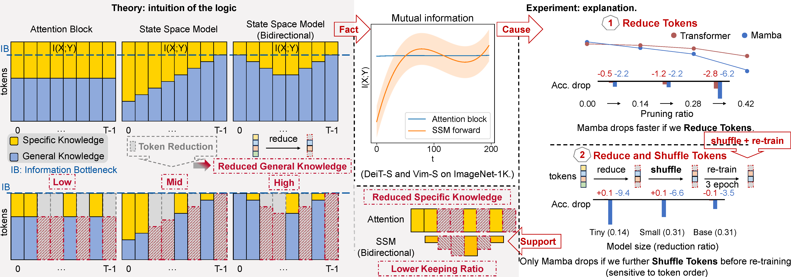
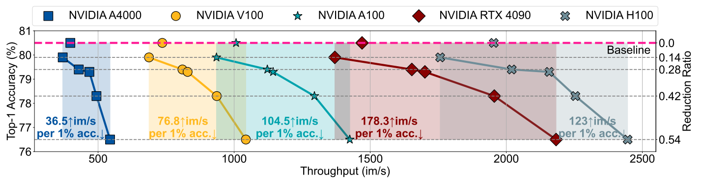
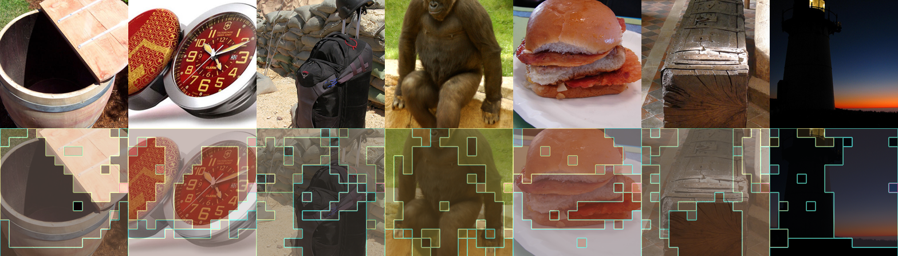

# R-MeeTo: Rebuild Your Faster Vision Mamba *in Minutes*

The official implementation of "Faster Vision Mamba is Rebuilt in Minutes via Merged Token Re-training".

> Mingjia Shi<sup>&ast;</sup>, Yuhao Zhou<sup>&ast;</sup>, Ruiji Yu<sup></sup>, Zekai Li<sup></sup>, Zhiyuan Liang<sup></sup>, Xuanlei Zhao<sup></sup>, Xiaojiang Peng<sup></sup>, Tanmay Rajpurohit<sup></sup>, Ramakrishna Vedantam<sup></sup>, Wangbo Zhao<sup>†</sup>, Kai Wang<sup>†</sup>, Yang You<sup></sup>
>
> (*: equal contribution, †: corresponding authors)
## Mingjia, Ruiji, Zekai, and Zhiyuan are looking for Ph.D. positions, many thanks for considering their applications.)
> 
> [Paper]()
> [Project Page](https://bdemo.github.io/R-MeeTo/)

## TL;DR

* Why is Mamba sensitive to token reduction? 
* Why does R-MeeTo (i.e., Merging + Re-training) work?

The anwser to all is the **key knowledge loss**.

https://github.com/user-attachments/assets/b4338d45-b218-45a5-831a-dda62d956257

The key knowledge loss mainly causes the heavier performance drop after applying token reduction. 
R-MeeTo is thus proposed, fast fixing key knowledge and therefore recovering performance.

R-MeeTo is simple and effective, with only two main modules: merging and re-training. 
Merging lowers the knowledge loss while re-training fast recovers the knowledge structure of Mamba.

https://github.com/user-attachments/assets/5377b158-72d0-4d20-b6ff-fc41a62c9aec

## Overview
<p align="center">


Figure: Analysis’ sketch: Mamba is sensitive to token reduction. Experiments about **i.** token reduction are conducted with DeiT-S
(Transformer) and Vim-S (Mamba) on ImageNet-1K. The reduction ratios in the experiment about **ii.** shuffled tokens are 0.14 for
Vim-Ti and 0.31 for Vim-S/Vim-B. Shuffle strategy is odd-even shuffle: [0,1,2,3]→[0,2],
[1,3]→[0,2,1,3]. The empirical results of I(X;Y), the mutual information between inputs X and outputs Y of the Attention Block and
SSM, are measured by MINE on the middle layers of DeiT-S and Vim-S (7-th/12 layers and the 14-th/24 layers respectively.) See this implementation repo of [MINE](https://github.com/BDeMo/MINE_SSM_Attention).   

> **Abstract:**
Vision Mamba (e.g., Vim) has successfully been integrated into computer vision, and token reduction has yielded promising outcomes in Vision Transformers (ViTs). However, token reduction performs less effectively on Vision Mamba compared to ViTs. Pruning informative tokens in Mamba leads to a high loss of key knowledge tokens and a drop in performance, making it not a good solution for enhancing efficiency. Token merging, which preserves more token information than pruning, has demonstrated commendable performance in ViTs, but vanilla merging performance decreases as the reduction ratio increases either, failing to maintain the key knowledge and performance in Mamba. Re-training the model with token merging, which effectively rebuilds the key knowledge, enhances the performance of Mamba. Empirically, pruned Vims, recovered on ImageNet-1K, only drop up to 0.9\% accuracy, by our proposed framework **R-MeeTo** in our main evaluation. We show how simple and effective the fast recovery can be achieved at minute-level, in particular, a 35.9\% accuracy spike over 3 epochs of training on Vim-Ti. Moreover, Vim-Ti/S/B are re-trained within 5/7/17 minutes, and Vim-S only drop 1.3\% with 1.2 $\times$ (up to 1.5 $\times$) speed up in inference.


## 🚀 News
- `2024.12.12`: The code is released.


## ⚡️ Faster Vision Mamba is Rebuilt in Minutes

| Hardware                      | Vim-Ti    | Vim-S     | Vim-B     |
|-------------------------------|-----------|-----------|-----------|
| 1 x 8 x H100 (single machine) | 16.2 mins | 25.2 mins | 57.6 mins |
| 2 x 8 x H100 (Infiniband)     | 8.1 mins  | 12.9 mins | 30.6 mins |
| 4 x 8 x H100 (Infiniband)     | 4.2 mins  | 6.8 mins  | 16.9 mins |

Wall time in minutes of re-training Vim-Ti, Vim-S and Vim-B for 3 epochs on 3 hardwares by R-MeeTo.
**Give us minutes, we give back a faster Mamba.**


## 🛠 Dataset Prepare
- For image datasets we use ImageNet-1K.
- For video datasets K400, you can download them from [OpenDataLab](https://opendatalab.org.cn/OpenMMLab/Kinetics-400) or their official websites. We follow the data list from [here](https://drive.google.com/drive/folders/17VB-XdF3Kfr9ORmnGyXCxTMs86n0L4QL?usp=sharing) to split the dataset.

## 🛠 Installation

#### 1. Clone the repository

```
git clone https://github.com/NUS-HPC-AI-Lab/R-MeeTo
```

#### 2. Create a new Conda environment

```
conda env create -f environment.yml
```
or install the necessary packages by requirement.txt

```
conda create -n R_MeeTo python=3.10.12
pip install -r requirements.txt
```
#### 3. Install Mamba package manually 

- For [Vim](https://github.com/hustvl/Vim) baseline: pip install the mamba package and casual-conv1d (version:1.1.1) in the Vim repo.
 ```
git clone https://github.com/hustvl/Vim
cd Vim 
pip install -e causal_conv1d==1.1.0
pip install -e mamba-1p1p1
```
- For [VideoMamba](https://github.com/OpenGVLab/VideoMamba) baseline: pip install the mamba package and casual-conv1d (version:1.1.0) in the VideoMamba repo.
 ```
git clone https://github.com/OpenGVLab/VideoMamba
cd VideoMamba
pip install -e causal_conv1d
pip install -e mamba
```

#### 4. Download the baseline pretrained models from our baseline official source
See [PRETRAINED](PRETRAINED.md) for downloading the pretrained model of our baseline. 


## ⚙️ Usage 

### 🛠️ Reproduce our results
#### For image task:
```
bash ./image_task/exp_sh/tab2/vim_tiny.sh
```
#### For video task:
```
bash ./video_task/exp_sh/tab13/videomamba_tiny.sh
```
#### Checkpoints:

See [CKPT](CKPT.md) to find our reproduced checkpoints and logs of the main results.

### ⏱️ Measure inference speed 
<p align="center">


R-MeeTo effectively optimizes inference speed and is adaptable for both consumer-level, enterprise-level and other high-performance devices. See [this example](image_task/example/test_speed.ipynb) for testing FLOPS (G) and throughput (im/s).


### 🖼️ Visualization
<p align="center">


 See [this example](image_task/example/visualization.ipynb) of visualization of merged token on ImageNet-1k val using a re-trained Vim-S.

## Citation
If you found our work useful, please consider citing us.
```

```


## Acknowledge
The repo is partly built based on [ToMe](https://github.com/facebookresearch/ToMe), [Vision Mamba](https://github.com/hustvl/Vim), and [VideoMamba](https://github.com/OpenGVLab/VideoMamba). We are grateful for their generous contributions to open source.
